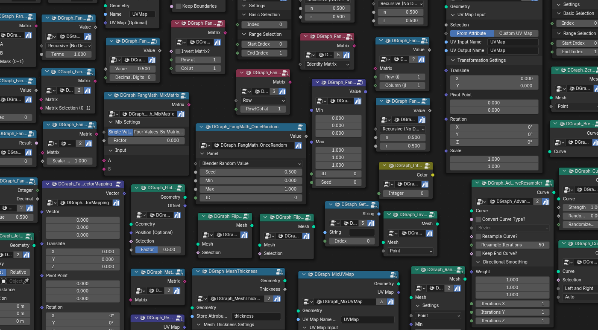

# DragonGraph's Toolset Pack

> Previously known as *Breathfang's Geometry Nodes Toolset Pack*. The GitHub repository URL
> ([Breathfang/BreathfangGeoNodes](https://github.com/Breathfang/BreathfangGeoNodes)) is unchanged.

  

  
  
  
  

  <h3>DragonGraph's Toolset Pack</h3>

  

    An open source collection of pre-made Geometry Nodes for Blender. The nodes generate
    geometry and add modifiers that speed up modelling and scenography.
  

  

    Free for commercial use, released under the
    <a href="LICENSE">GPL-3 License</a>. 🐲
  

  

> **New here?** The [documentation](https://breathfanggeonodes.readthedocs.io/en/latest/) covers
> installation, every node group, and troubleshooting. Note that the hosted documentation is
> currently **outdated** &mdash; geometry nodes are being prioritised over docs. Contributions to
> the documentation are very welcome; see [CONTRIBUTING.md](CONTRIBUTING.md).

## Table of contents

- [Requirements](#requirements)
- [Installation](#installation)
  - [Method 1: as an Add-on](#method-1-as-an-add-on)
  - [Method 2: as an Asset Library](#method-2-as-an-asset-library)
- [Updating](#updating)
- [Getting support](#getting-support)
- [Contributing](#contributing)
- [Repository scripts](#repository-scripts)
- [Upcoming features](#upcoming-features)
- [License](#license)

## Requirements

| Pack | Minimum Blender | Node prefix |
| ---- | --------------- | ----------- |
| Base asset library | 4.5 LTS | `DGraph_` |
| Extension add-on pack | 5.2 LTS | `DGraphNXT_` |

Contributors should develop against **Blender 5.2 LTS**. See
[Minimum version by pack version](#minimum-blender-version-by-pack-version) for the full
compatibility table, and note the warning below.

> [!WARNING]
> `DGraphNXT_` nodes do not work in Blender 4.5 LTS. Blender may silently drop them when you
> append them into a 4.5 LTS project.

### Minimum Blender version by pack version

| Pack version | Minimum Blender |
| ------------ | --------------- |
| v0.1.0-alpha | 4.2 LTS |
| v1.0.x-preview | 4.2 LTS |
| v1.1.x-alpha | 4.2 LTS |
| v1.2.x-beta | 4.5 LTS |
| v1.3.x-beta | 5.2 LTS |
| v1.4.x-beta | 5.2 LTS |
| v1.5.x-beta | 5.2 LTS |
| v2.0.x-preview | 5.2 LTS |
| v2.1.x-preview | 5.2 LTS |
| v2.2.x-preview | 5.5 LTS |
| v2.3.x-preview | 5.5 LTS |
| v2.4.x-preview | 5.5 LTS |
| v2.5.x-preview | 5.5 LTS |
| v3.0.x (stable) | 6.2 LTS |
| and more | ... |

## Installation

> [!IMPORTANT]
> **Never use a `.zip` file built by GitHub Actions.** Download an officially packaged release
> instead &mdash; see [Where to download](#where-to-download).

### Where to download

Stable and dev builds are published on the
[GitHub releases page](https://github.com/Breathfang/BreathfangGeoNodes/releases).

The pack is also planned for the platforms below. These listings are not live yet.

| Platform | Status | Link |
| -------- | ------ | ---- |
| Blender Extensions | _Coming soon_ | [extensions.blender.org](https://extensions.blender.org/add-ons/dragongraphs-geometry-nodes-toolset-pack/) |
| Gumroad | _Coming soon_ | [breathfang.gumroad.com](https://breathfang.gumroad.com/l/LmHKz) |
| SuperHive Market | _Coming soon_ | [superhivemarket.com](https://superhivemarket.com/products/breathfang-node-packs) |

> [!NOTE]
> Until these listings go live, download from the
> [GitHub releases page](https://github.com/Breathfang/BreathfangGeoNodes/releases).

### Method 1: as an Add-on

1. Download `DragonGraph's Toolset Pack <version> - Add-on.zip`
2. Extract it to a destination of your choice
3. Open `Edit -> Preferences -> Get Extensions`
4. Use the dropdown menu and choose `Install from disk...`
5. Select `<your_extracted_directory>/dragongraphs_geometry_nodes_toolset_pack.zip` and click
   `Install`

### Method 2: as an Asset Library

Use this method if you want the nodes available in every project, permanently.

1. Download `DragonGraph's Toolset Pack <version> - Asset Library.zip`
2. Extract it to a destination of your choice
3. Open `Edit -> Preferences -> File Paths -> Asset Libraries`
4. Click `(+)` to add a new library
5. Select `<your_extracted_directory>` and click `Add Asset Library`
6. Set the **Import Method** to `Append (Reuse Data)`

> [!WARNING]
> `Append (Reuse Data)` is mandatory. Setting the import method to `Link` will **break your
> project file** when you update to a newer version of the pack.

## Updating

To update, download the newer release and replace the old installation. Your existing project
files and node setups stay intact, as long as the import method is `Append (Reuse Data)`.

However, you do need to **reconnect the nodes and re-set up your values by hand** after updating.
Existing node setups are not migrated automatically.

- **Add-on method** &mdash; `Edit -> Preferences -> Get Extensions`, search for the extension,
  then click `Update`.
- **Asset Library method** &mdash; replace the `.blend` file in your library directory with the
  newer one, then restart Blender.

For full changelogs, see the
[GitHub releases](https://github.com/Breathfang/BreathfangGeoNodes/releases),
[extensions.blender.org](https://extensions.blender.org/add-ons/dragongraphs-geometry-nodes-toolset-pack/versions/),
or the [documentation changelogs](https://breathfanggeonodes.readthedocs.io/en/latest/).

## Getting support

If you hit a bug, run into a problem, or just have a question:

- Open an [issue](https://github.com/Breathfang/BreathfangGeoNodes/issues/new/choose)
- Reach out on social media:
  [@DrageonDB on X](https://x.com/DrageonDB) or
  [Breathfang on ArtStation](https://www.artstation.com/breathfang)
- Email &mdash; _coming soon_

Please include as much detail as you can: steps to reproduce, screenshots, Blender version, and
pack version.

## Contributing

Pull requests are welcome. New geometry nodes, new shading nodes, bug fixes, icon changes, and
documentation improvements are all in scope. If you are unsure what to contribute, just
[open an issue](https://github.com/Breathfang/BreathfangGeoNodes/issues/) and ask.

Before you start, please read [CONTRIBUTING.md](CONTRIBUTING.md) for the requirements, and
[FAQ.md](FAQ.md) for the questions that come up most often.

## Repository scripts

These helper scripts live in the repository root and require **Python 3.13 or higher**.

| Script | Purpose |
| ------ | ------- |
| [`_PythonLibraryAutoSetup.py`](_PythonLibraryAutoSetup.py) | Installs the documentation toolchain (`sphinx`, `sphinx-autobuild`, `sphinx_rtd_theme`) into your current interpreter. |
| [`.docsbuild.bat`](.docsbuild.bat) | Builds the documentation and serves it at <http://127.0.0.1:8000> with live reload. Windows only. |
| [`_NodepackZipGenerator.py`](_NodepackZipGenerator.py) | Packages the `.blend` file and the readme into a release `.zip` under `Generated Nodepacks/`. Run from the repository root. |

## Upcoming features

See the [GitHub Projects board](https://github.com/Breathfang/BreathfangGeoNodes/projects/).

## License

Released under the [GPL-3 License](LICENSE). You are free to use the pack commercially.
