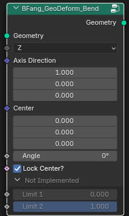
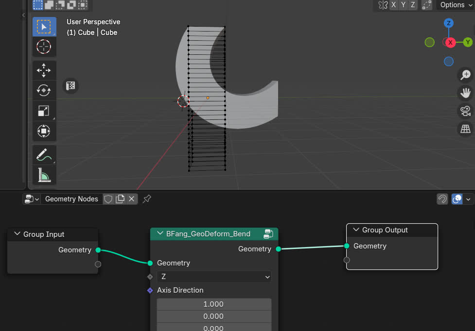

BFang_GeoDeform_Bend
====================

.. toctree::
    :maxdepth: 2
    :caption: Contents:

Description
-----------

Bend the mesh around axis.

Usage
-----

.. toctree::
    :maxdepth: 2
    :caption: Contents:

Input
-----

* **Geometry**: Mesh input.
* **Axis**: Axis to bend around.
* **Axis Direction**: Vector to bend around.
* **Center**: Center of the bend.
* **Angle**: Angle to bend.
* **Lock Center?**: Lock the center of the bend.

Output
------

* **Geometry**: Mesh output