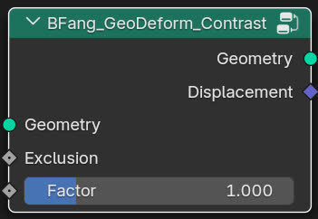

BFang_GeoDeform_Contrast
====================

.. toctree::
    :maxdepth: 2
    :caption: Contents:

Description
-----------

Amplify or reduce the "contrast" of the mesh. This is can be used for sharpen or smoothing the mesh.

Usage
-----

.. toctree::
    :maxdepth: 2
    :caption: Contents:

.. image:: example.jpg
   :target: example.jpg
   :width: 400px

Input
-----

* **Geometry**: Mesh input.
* **Exclusion**: Exclude the selection by exclusion factor (only on nodes).
* **Factor**: The factor to amplify or reduce the contrast.

Output
------

* **Geometry**: Mesh output
* **Displacement**: Displacement output