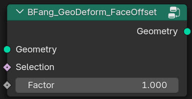

BFang_GeoDeform_FaceOffset
====================

.. toctree::
    :maxdepth: 2
    :caption: Contents:

Description
-----------

Offset individual faces.

Usage
-----

.. toctree::
    :maxdepth: 2
    :caption: Contents:

.. image:: example.jpg
   :target: example.jpg
   :width: 400px

Input
-----

* **Geometry**: Mesh input.
* **Selection**: Selected faces (only on nodes).
* **Factor**: Offset value.

Output
------

* **Geometry**: Mesh output