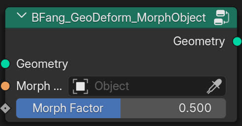

BFang_GeoDeform_MorphMesh
=========================

.. toctree::
    :maxdepth: 2
    :caption: Contents:

Description
-----------

Morph the mesh between two mesh states using a factor.

Usage
-----

.. image:: example.jpg
   :target: example.jpg
   :width: 400px

Input
-----

* **Geometry**: Mesh input.
* **Morph Target**: Targeted mesh.
* **Factor**: Morph factor.

Output
------

* **Geometry**: Mesh output