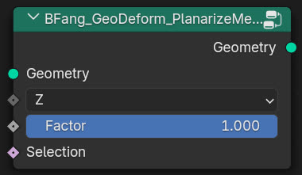

BFang_GeoDeform_PlanarizeMesh
=============================

.. toctree::
    :maxdepth: 2
    :caption: Contents:

Description
-----------

Flatten parts of a mesh towards a plane.

Usage
-----

.. image:: example.jpg
   :target: example.jpg
   :width: 400px

Input
-----

* **Geometry**: Mesh input.
* **Selection**: Selected faces (only on nodes).
* **Factor**: Offset value.

Output
------

* **Geometry**: Mesh output