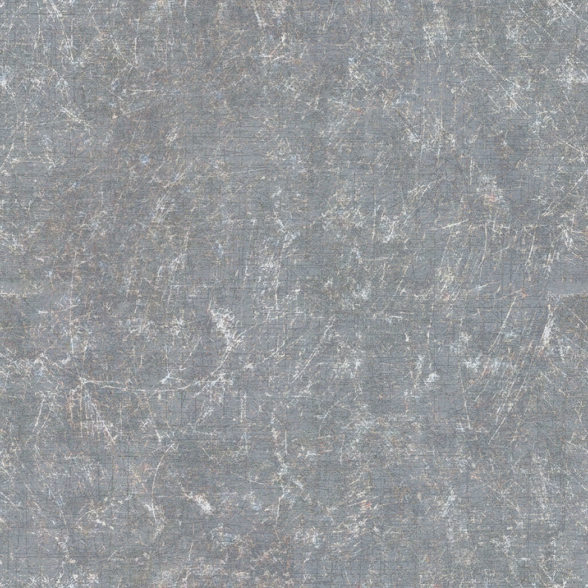

Welcome to Breathfang's Node Pack documentation!
================================================

.. toctree::
    :maxdepth: 2
    :caption: Contents:

Current GeoNode Version:
|version|

Welcome to the manual for Breathfang\'s Geometry Nodes Toolset Pack, the free and open source of Blender Geometry Node Pack.

Breathfang's Geometry Nodes Toolset Pack is a collection of Geometry Nodes tools designed to enhance your workflow in Blender. This pack includes various node groups and deformers that can be used to create complex geometry effects with ease.

The nodepack can be downloaded via:

.. raw:: html

    <ul>
        <li>
            
            <a href="https://breathfang.gumroad.com/l/LmHKz">Gumroad</a>
        </li>
        <li>
            
            <a href="https://superhivemarket.com/products/breathfang-node-packs">Superhivemarket</a>
        </li>
        <li>
            
            <a href="https://github.com/Breathfang/BreathfangGeoNodes">Github Release</a>
        </li>
        <li>
            
            <a href="https://github.com/Breathfang/BreathfangGeoNodes/tree/preview">Github Preview</a>
        </li>
    </ul>

Getting Started
===============

Here is for getting started

.. toctree::
   :maxdepth: 2
   :caption: Contents:

   intro
   usage
   nodes

Contents
--------

Here is the content for getting started with Breathfang's Geometry Nodes Toolset Pack.

Geometry Nodes
==============

Here is all the Geometry Nodes for Breathfang's Geometry Nodes Toolset Pack

* `Installation <./installation>`_
    * `Installing the add-on <./installation/install_addon>`_
    * `Installing node groups assets <./installation/install_node_groups>`_
* `Deformers <./deformers>`_
    * `BFang_GeoDeform_Bend <./deformers/bfang_geo_deform_bend>`_
    * `BFang_GeoDeform_Contrast <./deformers/bfang_geo_deform_contrast>`_
    * `BFang_GeoDeform_FaceOffset <./deformers/>`_
    * `BFang_GeoDeform_MatrixMeshOperations <./deformers/bfang_geo_deform_matrix_mesh_operations>`_
    * `BFang_GeoDeform_MeshOffset <./deformers/bfang_geo_deform_mesh_offset>`_
    * `BFang_GeoDeform_MorphMesh <./deformers/bfang_geo_deform_morph_mesh>`_
    * `BFang_GeoDeform_PlanarizeMesh <./deformers/bfang_geo_deform_planarize_mesh>`_
    * `BFang_GeoDeform_SelectionHook <./deformers/bfang_geo_deform_selection_hook>`_
    * `BFang_GeoDeform_Shear <./deformers/bfang_geo_deform>`_
    * `BFang_GeoDeform_Shear_2D <./deformers/bfang_geo_deform_shear_2d>`_
    * `BFang_GeoDeform_Shear_3D <./deformers/bfang_geo_deform_shear_3d>`_
    * `BFang_GeoDeform_SimpleMatrix <./deformers/bfang_geo_deform_simple_matrix>`_
    * `BFang_GeoDeform_Smooth <./deformers/bfang_geo_deform_smooth>`_
    * `BFang_GeoDeform_Stretch <./deformers/bfang_geo_deform_stretch>`_
    * `BFang_GeoDeform_StretchHook <./deformers/bfang_geo_deform_stretch_hook>`_
    * `BFang_GeoDeform_Taper <./deformers/bfang_geo_deform_taper>`_
    * `BFang_GeoDeform_ToSphere <./deformers/bfang_geo_deform_to_sphere>`_
    * `BFang_GeoDeform_Twist <./deformers/bfang_geo_deform_twist>`_
* `Generators <./generators>`_
    * `BFang_3DFillCurves <./generators/bfang_3d_fill_curves>`_
    * `BFang_3DGridInstances <./generators/bfang_3d_grid_instances>`_
    * `BFang_AdvancedArray <./generators/bfang_advanced_array>`_
    * `BFang_AnimFollowCurve <./generators/bfang_anim_follow_curve>`_
    * `BFang_CircularArray <./generators/bfang_circular_array>`_
    * `BFang_ConnectPoints <./generators/bfang_connect_points>`_
    * `BFang_CurveCatenaryEffect <./generators/bfang_catenary_effect>`_
    * `BFang_DrakeRemesher <./generators/bfang_drake_remesher>`_
    * `BFang_DynamicRotateObjectByCurve <./generators/bfang_dynamic_rotate_object_by_curve>`_
    * `BFang_DynamicScaleObjectByCurve <./generators/bfang_dynamic_scale_object_by_curve>`_
    * `BFang_GeoLerp <./generators/bfang_geo_lerp>`_
    * `BFang_GeoMeshAlongCurves <./generators/bfang_geo_mesh_along_curves>`_
    * `BFang_InstancesInVolume <./generators/bfang_instances_in_volume>`_
    * `BFang_InstancesOnEdge <./generators/bfang_instances_on_edge>`_
    * `BFang_InstancesOnSurface <./generators/bfang_instances_on_surface>`_
    * `BFang_InstancesInVolume <./generators/bfang_instances_in_volume>`_
    * `BFang_TextToMesh <./generators/bfang_text_to_mesh>`_
* `Math Functions <./math_functions>`_
    * `BFang_FangMath_AllBooleanMath <./math_functions/bfang_fang_math_all_boolean_math>`_
    * `BFang_FangMath_FlipValue <./math_functions/bfang_fang_math_flip_value>`_
    * `BFang_FangMath_FlipValueVector <./math_functions/bfang_fang_math_flip_value_vector>`_
    * `BFang_FangMath_FloorQuantization <./math_functions/bfang_fang_math_floor_quantization>`_
    * `BFang_FangMath_InRangeBoolean <./math_functions/bfang_fang_math_in_range_boolean>`_
    * `BFang_FangMath_MatrixAllZero <./math_functions/bfang_fang_math_matrix_all_zero>`_
    * `BFang_FangMath_MatrixMath <./math_functions/bfang_fang_math_matrix_math>`_
    * `BFang_FangMath_MatrixNoIdentity <./math_functions/bfang_fang_math_matrix_no_identity>`_
    * `BFang_FangMath_VectorAngleConventer <./math_functions/bfang_fang_math_vector_angle_conventer>`_
    * `BFang_FangMath_VectorClamp <./math_functions/bfang_fang_math_vector_clamp>`_
* `Mesh Modifiers <./mesh_modifiers>`_
    * `BFang_DecimateMesh <./modifiers/bfang_decimate_mesh>`_
    * `BFang_DeleteByMeshElements <./modifiers/bfang_delete_by_mesh_elements>`_
    * `BFang_FitSizeFromMeasure <./modifiers/bfang_fit_size_from_measure>`_
    * `BFang_FollowTransform <./modifiers/bfang_follow_transform>`_
    * `BFang_GeoDisplacement <./modifiers/bfang_geo_displacement>`_
    * `BFang_GeoInset <./modifiers/bfang_geo_inset>`_
    * `BFang_GeoMatch_BBoxScale <./modifiers/bfang_geo_match_bbox_scale>`_
    * `BFang_GeometryToOrigin <./modifiers/bfang_geometry_to_origin>`_
    * `BFang_GeoMirror <./modifiers/bfang_geo_mirror_2d>`_
    * `BFang_GeoSolidify <./modifiers/bfang_geo_solidify>`_
    * `BFang_GeoSubSurface <./modifiers/bfang_geo_subsurface>`_
    * `BFang_MeshNormalFix <./modifiers/bfang_mesh_normal_fix>`_
    * `BFang_MeshQuantizer <./modifiers/bfang_mesh_quantizer>`_
    * `BFang_ObjectToObjectSnapType <./modifiers/bfang_object_to_object_snap_type>`_
    * `BFang_MeshIsland_RandomDisappeareance <./modifiers/bfang_mesh_island_random_disappearance>`_
    * `BFang_MeshIsland_VisibleIndex <./modifiers/bfang_mesh_island_visible_index>`_
    * `BFang_MeshIsland_DeleteIsland <./modifiers/bfang_mesh_island_delete_island>`_
* `Curve Modifiers <./curve_modifiers>`_
    * `BFang_AdvancedCurveResampler <./curve_modifiers/bfang_advanced_curve_resampler>`_
    * `BFang_BreakCyclicCurve <./curve_modifiers/bfang_break_cyclic_curve>`_
    * `BFang_BreakCurve <./curve_modifiers/bfang_break_curve>`_
    * `BFang_SplitCurve <./curve_modifiers/bfang_split_curve>`_
    * `BFang_LoftSplines <./curve_modifiers/bfang_loft_splines>`_
    * `BFang_CurveConvert <./curve_modifiers/bfang_curve_convert>`_
* `UV Tools <./uv_tools>`_
    * `BFang_BoxUVProject <./uv_tools/bfang_box_uv_project>`_
    * `BFang_SphereUVProject <./uv_tools/bfang_circle_uv_project>`_
    * `BFang_CameraUVProject <./uv_tools/bfang_camera_uv_project>`_
    * `BFang_MeshUnwrap <./uv_tools/bfang_mesh_unwrap>`_
    * `BFang_GetUVSeams <./uv_tools/bfang_get_uv_seams>`_
    * `BFang_UVUnwrap <./uv_tools/bfang_uv_unwrap>`_
* `Utilities <./utilities>`_
    * `BFang_AdvancedNoiseTools <./utilities/bfang_advanced_noise_tools>`_
    * `BFang_BlendCrashIt <./utilities/bfang_blend_crash_it>`_
    * `BFang_BoundaryEdgeSelection <./utilities/bfang_boundary_edge_selection>`_
    * `BFang_DirectionalBlurAttribute <./utilities/bfang_directional_blur_attribute>`_

.. ==================
.. Indices and tables
.. ==================

.. * :ref:`genindex`
.. * :ref:`modindex`
.. * :ref:`search`
