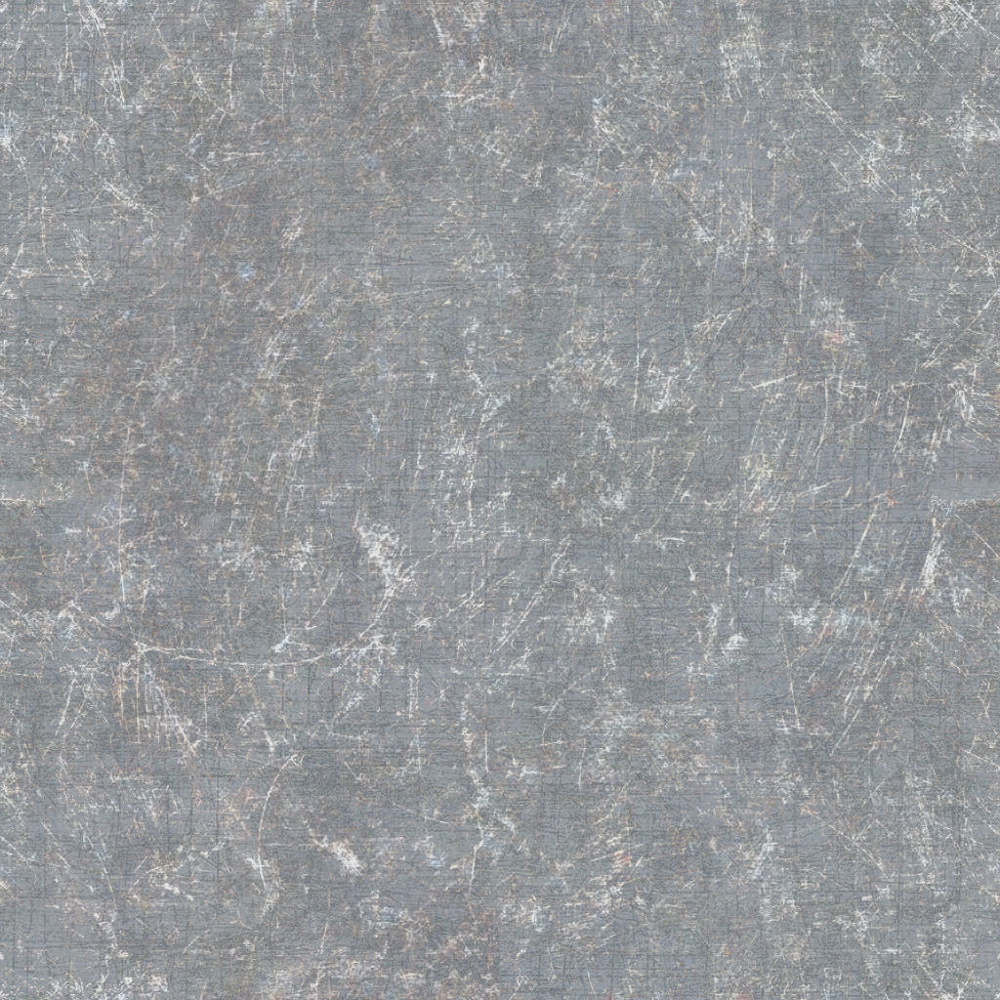

.. toctree::
    :maxdepth: 2
    :glob:
    :hidden:
    :caption: Welcome

    installation
    geometry_nodes
    troubleshooting
    changelogs
    contact

.. toctree::
    :maxdepth: 2
    :caption: Deformers
    :hidden:

    deformers/bend
    deformers/contrast
    deformers/face_offset
    deformers/matrix_mesh_op
    deformers/mesh_offset
    deformers/morph_mesh
    deformers/planarize_mesh
    deformers/selection_hook
    deformers/shear
    deformers/shear_2d
    deformers/shear_3d
    deformers/simple_matrix
    deformers/smooth
    deformers/stretch
    deformers/stretch_hook
    deformers/taper
    deformers/to_sphere
    deformers/twist

.. toctree::
    :maxdepth: 2
    :caption: Generators
    :hidden:

    generators/3d_fill_curves

Welcome to DragonGraph's (formerly Breathfang) Node Pack documentation!
=======================================================================

.. raw:: html

   

      <h2 style="margin-top:0.25rem; margin-bottom:0.25rem;">DragonGraph's Nodes Pack</h2>
      
Free and open source Blender Geometry Node Pack
        &mdash; current build <strong>v1.2.0-preview</strong>

   

**What is it?**

|packnamebold| is a collection of Geometry Nodes tools designed to enhance your workflow in Blender. This pack includes various node groups and deformers that can be used to create complex geometry effects with ease.

Download
--------

The nodepack can be downloaded from the options below:

.. raw:: html

   <table class="docutils align-default">
     <tbody>
       <tr class="row-odd">
         <td>
           
           <a href="https://github.com/Breathfang/BreathfangGeoNodes">GitHub Release</a>
         </td>
         <td>Stable releases and source code.</td>
       </tr>
       <tr class="row-even">
         <td>
           
           <a href="https://github.com/Breathfang/BreathfangGeoNodes/tree/preview">GitHub Preview</a>
         </td>
         <td>Latest development build &mdash; may be unstable.</td>
       </tr>
     </tbody>
   </table>

Features
--------

* `Deformer nodes <./deformers/index.html>`_ &mdash; bend, twist, stretch, taper, shear, morph and more.
* `Generator nodes <./generators/index.html>`_ &mdash; procedural geometry generation.
* Nodes are available for **Blender 4.5 LTS** and above.

Getting Started
===============

To get started with |packnamebold|, here is the pages:

* `Installation and Update <./installation.html>`_
* `Geometry Nodes <./geometry_nodes.html>`_
* `Troubleshooting <./troubleshooting.html>`_
* `Changelogs <./changelogs.html>`_
* `Contact/Feedback <./contact.html>`_

.. ==================
.. Indices and tables
.. ==================

.. * :ref:`genindex`
.. * :ref:`modindex`
.. * :ref:`search`
